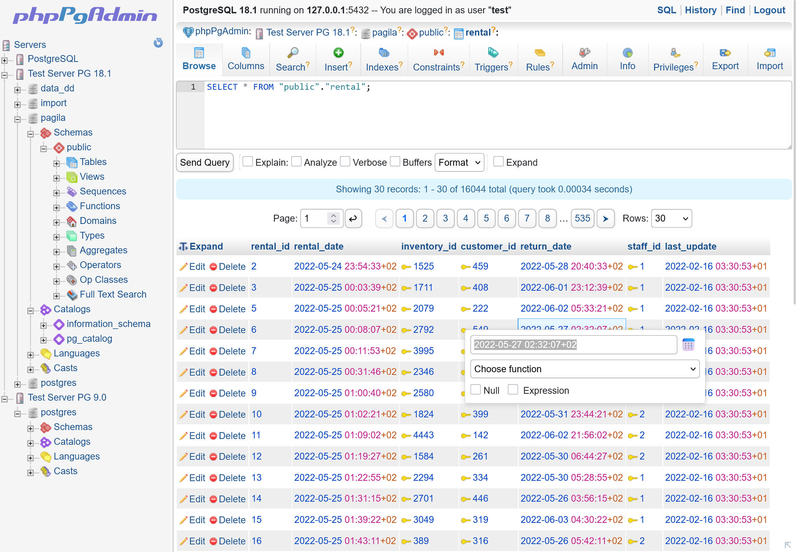

# phpPgAdmin


**现代化的基于 Web 的 PostgreSQL 管理工具** —— 通过直观的 Web 界面管理数据库、模式、表、角色、查询和备份。

[](LICENSE)
[](https://php.net/)
[](https://postgresql.org/download/)
[](https://github.com/pgadminpanel/phppgadmin/releases/latest)
[](docs/CHANGELOG-zh_CN.md)

---

## 📖 目录

- [概述](#概述)
- [功能特性](#功能特性)
- [系统要求](#系统要求)
- [安装](#安装)
- [配置](#配置)
- [安全](#安全)
- [文档](#文档)
- [贡献](#贡献)
- [许可证](#许可证)
- [致谢](#致谢)

---

## 概述

phpPgAdmin 是一个轻量级的、基于 Web 的 PostgreSQL 数据库管理工具。它为数据库管理员、开发人员和主机服务商提供了全面的界面，无需命令行即可管理 PostgreSQL 服务器。



**适用人群：**

- 管理多台 PostgreSQL 服务器的数据库管理员
- 需要快速访问数据库并执行查询的开发者
- 为客户提供 PostgreSQL 数据库管理服务的主机服务商
- 需要协作管理数据库的团队

**版本：** 8.0  
**项目主页：** https://github.com/phppgadmin/phppgadmin

---

## 功能特性

### 核心数据库管理

- **多服务器支持** —— 在单一界面中管理多台 PostgreSQL 服务器
- **服务器分组** —— 将服务器按逻辑分组管理
- **数据库操作** —— 创建、删除、重命名、修改数据库
- **模式管理** —— 完整的模式操作，包括创建、修改、更改所有者
- **表操作** —— 创建、修改、删除、清空表，支持高级选项
- **视图管理** —— 创建和管理视图及物化视图（创建、修改、删除）。物化视图可创建和刷新（支持时包括 `CONCURRENTLY`）；视图依赖关系和定义可查看和管理。
- **序列管理** —— 创建、修改和管理序列
- **函数管理** —— 创建、编辑和执行 PostgreSQL 函数
- **触发器管理** —— 创建和管理表触发器

### 数据管理

- **高级 SQL 编辑器** —— 集成 Ace Editor，支持语法高亮和自动补全
- **查询执行** —— 执行 SQL 查询，结果分页显示
- **数据浏览** —— 浏览表数据，支持排序、过滤和分页
- **数据编辑** —— 插入、更新和删除行，支持外键自动补全
- **查询历史** —— 记录并复用之前执行的查询
- **全文检索** —— 管理全文检索配置和词典

### 导入/导出

- **统一导出架构** —— 高效流式处理大型导出
- **多种导出格式：**
    - SQL（INSERT 语句，单行或多行）
    - PostgreSQL COPY 格式
    - CSV（符合 RFC 4180）
    - 制表符分隔
    - HTML 表格
    - 带元数据的 XML
    - 带列元数据的 JSON
- **表/数据库转储** —— 导出表结构和数据
- **数据导入** —— 从多种格式导入数据
- **备份操作** —— 集成 pg_dump 和 pg_dumpall

### 安全与访问控制

- **角色管理** —— 创建和管理数据库角色与用户
- **权限管理** —— 授予和撤销数据库对象的权限
- **多种认证方式：**
    - 基于 Cookie 的认证（默认）
    - HTTP Basic 认证
    - 基于配置的认证（加密凭据）
- **SSL 连接支持** —— 安全的数据库连接
- **密码加密** —— 基于配置的认证使用加密密码存储

### 高级 PostgreSQL 特性

- **聚合函数** —— 创建和管理自定义聚合
- **转换操作** —— 管理类型转换
- **自定义操作符** —— 创建和管理操作符
- **操作符类** —— 管理索引操作符类
- **域** —— 创建和管理域类型
- **复合类型** —— 创建自定义复合类型
- **索引管理** —— 创建各种类型的索引（B-tree、Hash、GiST、GIN、BRIN）
- **并发索引创建** —— 不阻塞写入的情况下构建索引
- **约束管理** —— 主键、外键、唯一、CHECK 约束
- **生成列** —— 定义和管理存储生成列（PostgreSQL 12+）：添加、修改或删除生成列，并在数据浏览器中显示生成值。
- **分区表** —— 创建和管理分区表及分区；挂载/卸载分区，查看分区层次和分区约束。
- **表空间管理** —— 管理表空间分配
- **规则管理** —— 创建和管理表规则
- **语言管理** —— 安装和管理过程语言

### 用户界面

- **框架式导航** —— 树形导航的单页应用体验
- **基于树的浏览** —— 数据库对象的层次化视图
- **多种主题：**
    - Default（经典 phpPgAdmin）
    - Bootstrap（现代响应式设计）
    - Cappuccino（深色主题）
    - Gotar（极简风格）
- **日期/时间选择器** —— 集成 Flatpickr
- **语法高亮** —— 使用 Highlight.js 高亮 SQL 和代码
- **响应式设计** —— 适用于桌面和平板设备
- **国际化** —— 30+ 种语言翻译

### 性能与监控

- **统计查看** —— 数据库、表、索引统计（需启用统计收集器）
- **查询跟踪** —— 监控运行中的查询
- **表分析** —— ANALYZE 和 VACUUM 操作
- **索引使用统计** —— 监控索引效率

### 插件系统

- **可扩展架构** —— 插件系统支持自定义功能
- **内置插件：**
    - GuiControl —— GUI 自定义
    - Report —— 自定义报表功能

---

## 系统要求

### 服务器要求

- **PHP：** 7.4 或更高（推荐 8.3+）
- **PostgreSQL：** 9.0 或更高（推荐 12+）
- **Web 服务器：** Apache、Nginx 或任何支持 PHP 的 Web 服务器

### PHP 扩展

- `ext-pgsql` —— PostgreSQL 数据库函数（必需）
- `ext-mbstring` —— 多字节字符串处理（必需）
- `ext-sodium` —— 用于密码存储的加密（必需）
- `ext-json` —— JSON 处理（通常默认启用）
- `ext-session` —— 会话管理（通常默认启用）

### PostgreSQL 配置

- 启用统计收集器（推荐）：
    ```
    track_activities = on
    track_counts = on
    ```
- 在 `pg_hba.conf` 中配置密码认证（强烈推荐）

### 浏览器要求

- 启用 JavaScript 的现代浏览器
- 启用 Cookie 以支持会话管理
- 推荐：Chrome、Firefox、Safari、Edge（最新版本）

---

## 安装

### 快速安装

1. **下载 phpPgAdmin**

    ```bash
    # 从 GitHub releases 下载
    wget https://github.com/phppgadmin/phppgadmin/archive/refs/heads/master.zip
    unzip master.zip
    cd phppgadmin-master
    ```

2. **安装依赖**

    ```bash
    composer install --no-dev --optimize-autoloader
    ```

3. **配置 phpPgAdmin**

    ```bash
    cp conf/config-dist.inc.php conf/config.inc.php
    nano conf/config.inc.php
    ```

    编辑服务器配置：

    ```php
    $conf['servers'][0]['desc'] = 'PostgreSQL';
    $conf['servers'][0]['host'] = 'localhost';
    $conf['servers'][0]['port'] = 5432;
    $conf['servers'][0]['sslmode'] = 'allow';
    $conf['servers'][0]['defaultdb'] = 'postgres';
    ```

4. **设置权限**

    ```bash
    # 确保 Web 服务器可以写入 sessions 和 temp 目录
    chmod 755 sessions temp
    chown www-data:www-data sessions temp
    ```

5. **访问 phpPgAdmin**

    打开浏览器并访问：

    ```
    http://your-server/phppgadmin/
    ```

### 详细安装

请参阅 [INSTALL.md](INSTALL.md) 获取详细安装说明，包括：

- 不同压缩包格式（tar.gz、tar.bz2、zip）
- Web 服务器配置
- 安全加固
- PostgreSQL 配置建议

---

## 配置

### 基本配置

主配置文件为 `conf/config.inc.php`。关键配置项：

#### 服务器配置

```php
// 服务器 0 - 本地 PostgreSQL
$conf['servers'][0]['desc'] = 'Local PostgreSQL';
$conf['servers'][0]['host'] = 'localhost';  // '' 表示使用 Unix socket
$conf['servers'][0]['port'] = 5432;
$conf['servers'][0]['sslmode'] = 'allow';   // disable, allow, prefer, require
$conf['servers'][0]['defaultdb'] = 'postgres';
```

#### 多服务器

```php
// 服务器 1 - 生产服务器
$conf['servers'][1]['desc'] = 'Production DB';
$conf['servers'][1]['host'] = 'prod-db.example.com';
$conf['servers'][1]['port'] = 5432;
$conf['servers'][1]['sslmode'] = 'require';

// 服务器 2 - 开发服务器
$conf['servers'][2]['desc'] = 'Development DB';
$conf['servers'][2]['host'] = 'dev-db.example.com';
$conf['servers'][2]['port'] = 5432;
```

#### 服务器分组

```php
// 分组管理服务器
$conf['srv_groups'][0]['desc'] = 'Production Servers';
$conf['srv_groups'][0]['servers'] = '0,1';

$conf['srv_groups'][1]['desc'] = 'Development Servers';
$conf['srv_groups'][1]['servers'] = '2,3';
```

### 认证方式

#### 表单认证（默认）

标准登录表单 —— 用户在登录页输入凭据：

```php
$conf['servers'][0]['auth_type'] = 'form';
```

#### HTTP Basic 认证

从 HTTP Basic Auth 头获取凭据：

```php
$conf['servers'][0]['auth_type'] = 'http';
```

#### 基于配置的认证

加密凭据存储在配置中（适用于单用户场景）：

1. **生成加密密钥：**

    ```bash
    php bin/encrypt-password.php --generate-key
    ```

2. **设置加密密钥：**

    ```php
    // 存储在环境变量中（推荐）：
    // export PHPPGADMIN_ENCRYPTION_KEY="your-64-char-hex-key"

    // 或在 config.inc.php 中（安全性较低）：
    $conf['encryption_key'] = 'your-64-char-hex-key';
    ```

3. **加密密码：**

    ```bash
    php bin/encrypt-password.php --password "mypassword"
    ```

4. **配置服务器：**
    ```php
    $conf['servers'][0]['auth_type'] = 'config';
    $conf['servers'][0]['username'] = 'myuser';
    $conf['servers'][0]['password'] = 'ENCRYPTED:base64encryptedpassword';
    ```

### 高级配置

#### 显示设置

```php
// 每页显示的最大行数
$conf['max_rows'] = 30;

// 完整显示的最大字段长度
$conf['max_chars'] = 50;

// 显示高级对象（聚合、类型、操作符等）
$conf['show_advanced'] = false;

// 显示系统模式（pg_catalog、information_schema）
$conf['show_system'] = false;
```

#### 安全设置

```php
// 额外登录安全（禁止常见超级用户名无密码登录）
$conf['extra_login_security'] = true;

// 仅限拥有的数据库（用户只能看到自己拥有的数据库）
$conf['owned_only'] = false;
```

#### 主题选择

```php
// 可选：'default'、'bootstrap'、'cappuccino'、'gotar'
$conf['theme'] = 'default';
```

#### 导出设置

```php
// PostgreSQL 转储工具的路径
$conf['servers'][0]['pg_dump_path'] = '/usr/bin/pg_dump';
$conf['servers'][0]['pg_dumpall_path'] = '/usr/bin/pg_dumpall';
```

---

## 安全

### 安全最佳实践

1. **启用密码认证**

    配置 `pg_hba.conf` 要求密码：

    ```
    # TYPE  DATABASE        USER            ADDRESS                 METHOD
    host    all             all             127.0.0.1/32            md5
    host    all             all             ::1/128                 md5
    ```

2. **设置强 PostgreSQL 密码**

    ```sql
    ALTER USER postgres WITH PASSWORD 'strong-password-here';
    ```

3. **启用额外登录安全**

    在 `config.inc.php` 中：

    ```php
    $conf['extra_login_security'] = true;
    ```

    这可以防止以常见超级用户名无密码登录。

4. **使用 SSL 连接**

    ```php
    $conf['servers'][0]['sslmode'] = 'require';
    ```

5. **保护加密密钥**

    将加密密钥存储在环境变量中：

    ```bash
    export PHPPGADMIN_ENCRYPTION_KEY="your-64-char-hex-key"
    ```

    切勿将加密密钥提交到版本控制系统。

6. **文件权限**

    ```bash
    # 配置文件不应全局可读
    chmod 640 conf/config.inc.php
    chown root:www-data conf/config.inc.php

    # 确保 temp 和 sessions 目录不可通过 Web 访问
    # 使用 .htaccess 或服务器配置
    ```

7. **保持软件更新**
    - 定期更新 phpPgAdmin
    - 保持 PHP 和 PostgreSQL 更新
    - 关注安全公告

### 已知安全考量

- **SQL 注入：** 所有查询使用参数化语句
- **XSS 防护：** 输出使用 `htmlspecialchars()` 转义
- **CSRF 防护：** 状态变更操作使用令牌
- **认证：** 基于会话，使用安全 Cookie
- **授权：** 操作前进行权限检查
- **文件操作：** 路径验证和清理

---

## 文档

### 可用文档

- **[INSTALL](INSTALL.md)** —— 安装说明
- **[FAQ](FAQ.md)** —— 常见问题
- **[CHANGES](CHANGES.md)** —— 版本历史和更新日志
- **[DEVELOPERS](DEVELOPERS)** —— 开发指南
- **[TODO](TODO.md)** —— 未来开发计划
- **[LICENSE](LICENSE)** —— GPL-2.0+ 许可证文本
- **[CREDITS](CREDITS)** —— 贡献者和翻译者

### 语言文件

phpPgAdmin 支持 30+ 种语言。翻译文件位于 `lang/` 目录：

- 英语、法语、德语、西班牙语、意大利语、葡萄牙语、俄语
- 中文（简体/繁体）、日语、韩语
- 阿拉伯语、希伯来语、土耳其语、波兰语、捷克语、荷兰语、瑞典语
- 以及更多！

如需贡献翻译，请参阅 `lang/README`。

---

## 贡献

我们欢迎各种贡献！phpPgAdmin 是自由/开源软件，依赖社区贡献。

### 如何贡献

1. **报告 Bug**
    - 使用 GitHub Issues
    - 提供详细描述
    - 包含 PostgreSQL 版本
    - 包含 phpPgAdmin 版本
    - 复现步骤

2. **提交 Pull Request**
    - 遵循上述开发工作流
    - 为新功能包含测试
    - 更新文档
    - 遵循编码规范
    - 跨 PostgreSQL 版本测试

3. **翻译**
    - 在 `lang/` 中添加/更新语言文件
    - 遵循翻译指南
    - 使用实际应用测试

4. **编写文档**
    - 改进现有文档
    - 添加教程
    - 创建示例
    - 记录最佳实践

### 社区

- **GitHub：** https://github.com/phppgadmin/phppgadmin
- **Issues：** https://github.com/phppgadmin/phppgadmin/issues
- **Pull Requests：** https://github.com/phppgadmin/phppgadmin/pulls

---

## 许可证

phpPgAdmin 基于 **GNU 通用公共许可证 v2.0 或更高版本** 授权。

```
Copyright (c) 2002 - 2019 The phpPgAdmin Project

This program is free software; you can redistribute it and/or modify
it under the terms of the GNU General Public License as published by
the Free Software Foundation; either version 2 of the License, or
(at your option) any later version.

This program is distributed in the hope that it will be useful,
but WITHOUT ANY WARRANTY; without even the implied warranty of
MERCHANTABILITY or FITNESS FOR A PARTICULAR PURPOSE.  See the
GNU General Public License for more details.
```

完整许可证文本请参阅 [LICENSE](LICENSE) 文件。

---

## 致谢

### 项目管理员

- Robert Treat (xzilla) —— 项目管理与重大项目

### 主要贡献者

完整列表请参阅 [CREDITS](CREDITS) 文件，包括：

- 核心开发者
- 翻译者（30+ 种语言）
- 主题设计者
- 功能贡献者

### 第三方库

- **ADOdb** —— 数据库抽象层
- **Ace Editor** —— 代码编辑器
- **Flatpickr** —— 日期/时间选择器
- **Highlight.js** —— 语法高亮
- **fflate** —— 压缩库
- **greenlion/php-sql-parser** —— SQL 解析

---

## 支持

### 获取帮助

1. **查看 FAQ：** 参阅 [FAQ](FAQ.md) 解决常见问题
2. **阅读文档：** 查看 [docs/](docs/) 获取技术细节
3. **搜索 Issues：** 在 GitHub 上查找类似问题
4. **询问社区：** 如需要，创建新的 GitHub issue

### 报告问题

报告问题时，请包含：

- phpPgAdmin 版本
- PHP 版本（`php -v`）
- PostgreSQL 版本（`SELECT version()`）
- 浏览器及版本
- 操作系统
- 详细描述和复现步骤
- 浏览器控制台和 PHP 日志中的错误信息

---

## 致谢

phpPgAdmin 自 2002 年以来由一个专注的开发者、翻译者和用户社区开发维护。我们感谢所有为 phpPgAdmin 成为可靠的 PostgreSQL 数据库管理工具做出贡献的人。

特别感谢：

- PostgreSQL 社区创造了出色的数据库
- 所有提交补丁、翻译和 Bug 报告的贡献者
- 提供反馈和建议的用户
- 将 phpPgAdmin 与其服务捆绑的主机服务商

---

**由 phpPgAdmin 社区用 ❤️ 制作**

更多信息，请访问：https://github.com/phppgadmin/phppgadmin